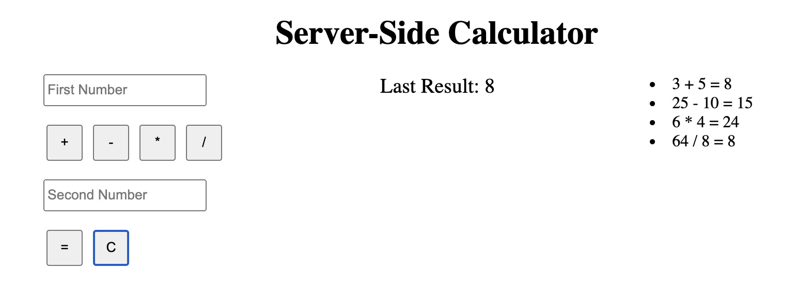

# Weekend Server Calculator

## Description

This project was focused on creating a calculator that makes and stores calculations on the server side, and then displays the results on the browser. Users can enter basic calculations on the browser which are then sent to the server. The server makes the calculations before the client receives the result, as well as a history of the results, via a GET request. The browser then renders the latest answer and displays the entire history of calculations. 

## Screen Shot

### Prerequisites

- [Node.js](https://nodejs.org/en/)
- [Axios.js](https://axios-http.com/)
- [Express.js](https://expressjs.com/)

## Installation

1. Open up your editor of choice and run an `npm install express`
2. Run `npm run start` in your terminal
3. Open the browser and visit the url localhost:5001

## Usage

1. Enter a number into the 'First Number' input
2. Click an operator
3. Enter a number into the 'Second Number' input
4. Press the '=' button to evaluate the equation
5. Press 'C' to clear the inputs

## Built With

- Node.js
- Axios.js
- Express.js

## Acknowledgement
Thanks to [Prime Digital Academy](www.primeacademy.io) and Key!

